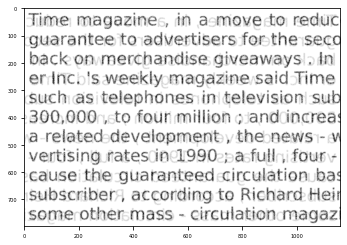
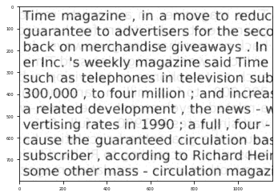
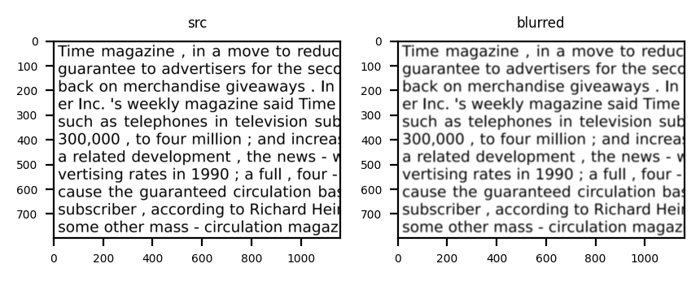
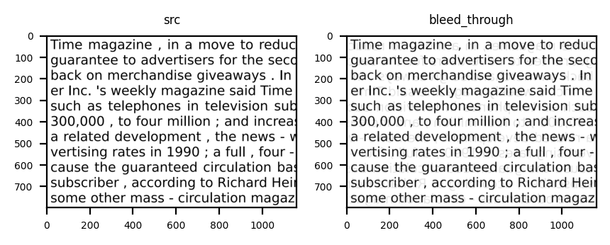
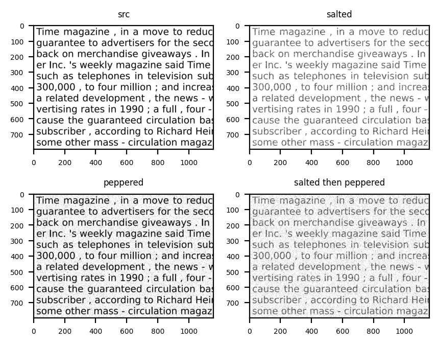
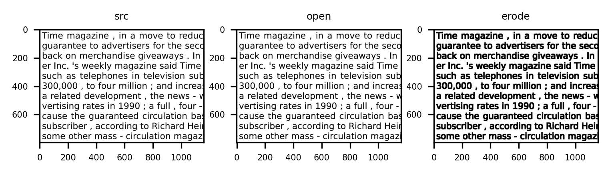
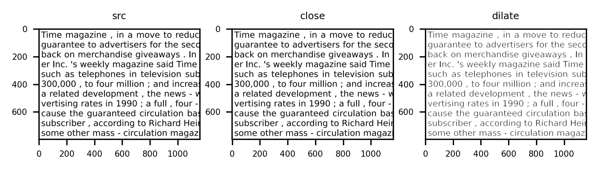
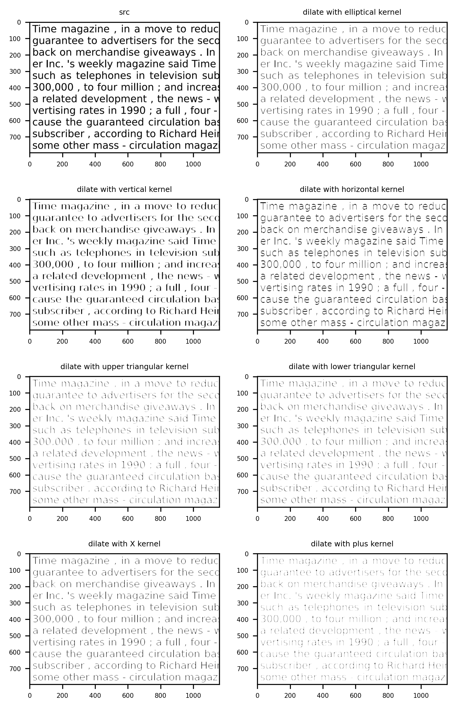

## Image Degradation

This folder contains the scripts that allow you degrade your images with real world degradations.

### Degrader

The `Degrader` class is the standard way to apply multiple degradations to an image.

```python
import cv2
from genalog.degradation.degrader import Degrader
from matplotlib import pyplot as plt

# Load in sample image
src = cv2.imread('sample/degradation/text_zoomed.png', cv2.IMREAD_GRAYSCALE)

# We are applying degradation effects to the images in the following sequence:
# blur -> bleed_through -> salt
degradations = [
    ("blur", {"radius": 3}),
    ("bleed_through", {"alpha": 0.8}),
    ("salt", {"amount": 0.5}),
]
# All of the referenced degradation effects are in submodule `genalog.degradation.effect`

degrader = Degrader(degradations)
dst = degrader.apply_effects(src)
plt.imshow(dst, cmap="gray")
```

<p float="left">
  
</p>

#### Advanced Degradation Configurations

`genalog` provides an enumeration `ImageState` to reference the image at different state in the degradation process. For example:

1. `ImageState.ORIGINAL_STATE` refers to the origin state of the image before applying any degradation, while
1. `ImageState.CURRENT_STATE` refers to the state of the image after applying the last degradation effect.

```python
from genalog.degradation.degrader import Degrader, ImageState

degradations = [
    ("morphology", {"operation": "open", "kernel_shape":(9,9), "kernel_type":"plus"}),
    ("morphology", {"operation": "close", "kernel_shape":(9,1), "kernel_type":"ones"}),
    ("salt", {"amount": 0.7}),
    ("overlay", {
        "src": ImageState.ORIGINAL_STATE,
        "background": ImageState.CURRENT_STATE,
    }),
    ("bleed_through", {
        "src": ImageState.CURRENT_STATE,
        "background": ImageState.ORIGINAL_STATE,
        "alpha": 0.90,
        "offset_x": -5,
        "offset_y": -5,
    }),
    ("pepper", {"amount": 0.005}),
    ("blur", {"radius": 3}),
    ("salt", {"amount": 0.15}),
]

degrader = Degrader(degradations)
dst = degrader.apply_effects(src)
plt.imshow(dst, cmap="gray")
```

<p float="left">
  
</p>

### Document Blurring

An effect that occurs when scanner cannot focus on the document properly that results in document looking foggy/hazy. 
```python
# Import Genalog Degradations and other libraries
import genalog.degradation.effect as effect
import cv2
from matplotlib import pyplot as plt

# Load in sample image
src = cv2.imread('sample/degradation/text_zoomed.png', cv2.IMREAD_GRAYSCALE)
# Add noise to the Image
blurred = effect.blur(src, radius=7) # the larger the radius, the lower the contrast
plt.imshow(blurred, cmap="gray")
plt.title('blurred', fontsize=6)
plt.show()
```

<p float="left">
  
</p>

### Bleed Through
This effect tries to mimic the seepage of ink from one side of a printed page to the other.
```python
# Import Genalog Degradations and other libraries
import genalog.degradation.effect as effect
import cv2
from matplotlib import pyplot as plt

# Load in sample image
src = cv2.imread('sample/degradation/text_zoomed.png', cv2.IMREAD_GRAYSCALE)
# Add noise to the Image
bleed_through = effect.bleed_through(src, alpha=0.9)# higher the alpha, the less visible is the effect
plt.imshow(bleed_through, cmap="gray")
plt.title('bleed_through', fontsize=6)
plt.show()
```

<p float="left">
  
</p>


### Salt and Pepper noise
In this effect we randomly sprinkle "salt" (white pixels) and "pepper" (dark pixels) onto the original image to imitate ink degradation and page degradation.
```python
# Import Genalog Degradations and other libraries
import genalog.degradation.effect as effect
import cv2
from matplotlib import pyplot as plt

# Load in sample image
src = cv2.imread('sample/degradation/text_zoomed.png', cv2.IMREAD_GRAYSCALE)
# Add noise to the Image
salted = effect.salt(src, amount=0.4) # amount is the percentage of pixels to be salted (whitened)
plt.imshow(salted, cmap="gray")
plt.title('Salted', fontsize=6)
plt.show()
```

<p float="left">
  
</p>

### Morphological Degradations

`Morphological Degradations` : Morphological operations is a structural degradation commonly applied on a binary image. For more information, please see [link](http://homepages.inf.ed.ac.uk/rbf/HIPR2/morops.htm). The convention for these binary images is to have the subject, or the foreground, in white on a black background. However, our example image has the subject in black on a white background, so the morphological degradation will have the effect opposite to its name.

#### Erosion and Open


```python
# Import Genalog Degradations and other libraries
import genalog.degradation.effect as effect
import cv2
from matplotlib import pyplot as plt

# Load in sample image
src = cv2.imread('sample/degradation/text_zoomed.png', cv2.IMREAD_GRAYSCALE)

# Add noise to the Image
kernel = effect.create_2D_kernel((5,5), kernel_type="ones")
erode = effect.erode(src, kernel)
open = effect.open(src, kernel) # retains more of the foreground shape than erosion, given the same kernel

# display input and output image
fig = plt.figure(figsize=(6, 4), dpi=300)
fig.add_subplot(1,3,1)
plt.imshow(src, cmap="gray")
plt.title('src', fontsize=6)
fig.add_subplot(1,3,2)
plt.imshow(open, cmap="gray")
plt.title('open', fontsize=6)
fig.add_subplot(1,3,3)
plt.imshow(erode, cmap="gray")
plt.title('erode', fontsize=6)
plt.show()
```

<p float="left">
  
</p>


Here we are “opening” up the foreground structures (text) and joining the character structuring together. In another perspective, we are “eroding” away the white background by expanding the foreground. 

#### Erosion and Open

```python
kernel = effect.create_2D_kernel((3,3), kernel_type="ones")
dilate = effect.dilate(src, kernel)
close = effect.close(src, kernel) # less destructive than dilation, given the same kernel

# display input and output image
fig = plt.figure(figsize=(6, 4), dpi=300)
fig.add_subplot(1,3,1)
plt.imshow(src, cmap="gray")
plt.title('src', fontsize=6)
fig.add_subplot(1,3,2)
plt.imshow(close, cmap="gray")
plt.title('close', fontsize=6)
fig.add_subplot(1,3,3)
plt.imshow(dilate, cmap="gray")
plt.title('dilate', fontsize=6)
plt.show()
```

<p float="left">
  
</p>

We are “closing” or “dilating” the white background, thus chipping away the foreground structures (text). This effect can mimic the effect of degrading ink or a printer running out of ink. 

#### Kernel Size and Shape

An important element of the morphological degradation is the [structuring element](http://homepages.inf.ed.ac.uk/rbf/HIPR2/strctel.htm), or the kernel used. With proper size and shape of the kernel, one can extract interesting structures of the source image.

<p float="left">
  
</p>

```python
elliptical_kernel = effect.create_2D_kernel((4,4), kernel_type="ellipse")
vertical_kernel = effect.create_2D_kernel((5,1), kernel_type="ones")
horizontal_kernel = effect.create_2D_kernel((1,5), kernel_type="ones")
upper_tri_kernel = effect.create_2D_kernel((5,5), kernel_type="upper_triangle")
lower_tri_kernel = effect.create_2D_kernel((5,5), kernel_type="lower_triangle")
x_kernel = effect.create_2D_kernel((4,4), kernel_type="x")
plus_kernel = effect.create_2D_kernel((6,6), kernel_type="plus")

dilate_w_elliptical_k = effect.dilate(src, elliptical_kernel)
dilate_w_vertical_k = effect.dilate(src, vertical_kernel)
dilate_w_horizontal_k = effect.dilate(src, horizontal_kernel)
dilate_w_upper_tri_k = effect.dilate(src, upper_tri_kernel)
dilate_w_lower_tri_k = effect.dilate(src, lower_tri_kernel)
dilate_w_x_kernel = effect.dilate(src, x_kernel)
dilate_w_plus_kernel = effect.dilate(src, plus_kernel)
```
