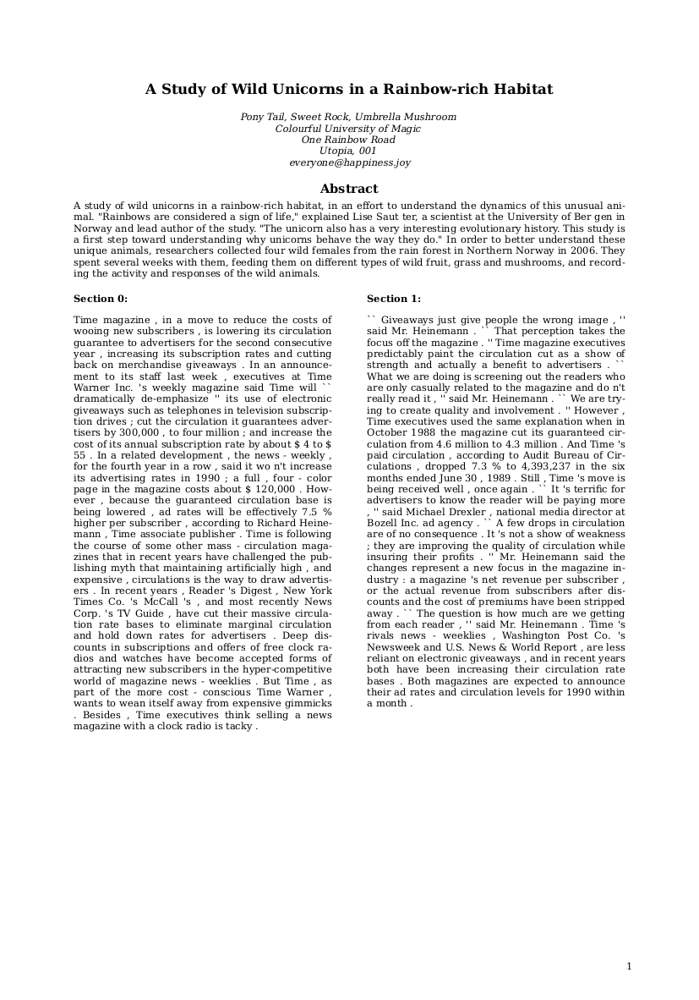
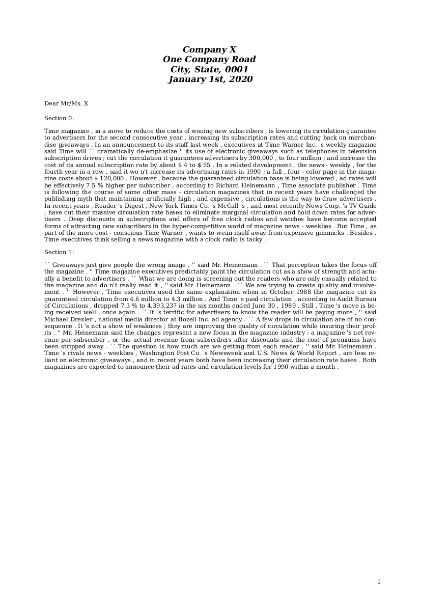
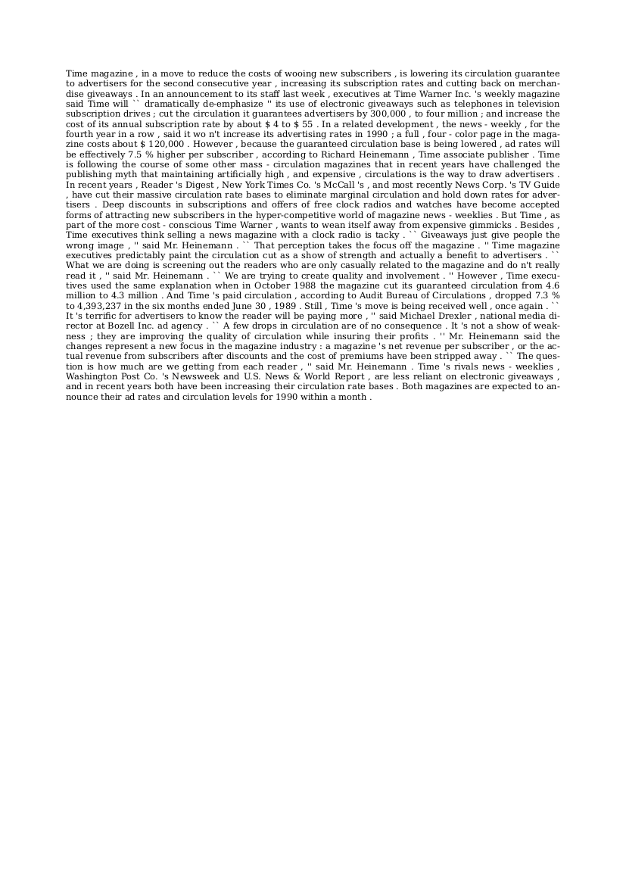

## Document Generation

This folder contains the scripts that allow you generate synthetic documents from any given text. We provide **three** standard templates for with document layouts:

<p float="left">
  
  
  
</p>

You can find these templates in path `genalog/generation/templates`.

### 1. Document Content

The goal is to be able to generate synthetic documents on ANY text input. However, to properly initiate the content populating a document template, we need to create the `CompositeContent` class.

```python
from genalog.generation.content import CompositeContent, ContentType

# Here we are loading an sample text file in the root "example" directory
# You may use any text as well.
with open("example/sample/generation/example.txt", 'r') as f:
    text = f.read()

# Initialize CompositeContent Object
paragraphs = text.split('\n\n') # split paragraphs by `\n\n`
content_types = [ContentType.PARAGRAPH] * len(paragraphs)
content = CompositeContent(paragraphs, content_types)
```
The `CompositeContent` is a list of pairs of bodies of text and their `ContentType`. Here we can declaring a list of multiple `ContentType.PARAGRAPH`s.

### 2. Populate Content into Template

Once we initialized a `CompositeContent` object, we can populate the content into any standard template, via `DocumentGenerator` class.

```python
from genalog.generation.document import DocumentGenerator
default_generator = DocumentGenerator()

print(f"Available default templates: {default_generator.template_list}")
print(f"Default styles to generate: {default_generator.styles_to_generate}")
```
The `DocumentGenerator` has default styles. The above code snippet will show the default configurations and the names of the 3 standard templates. You will use the information to select the template you want to generate. The three templates are `["columns.html.jinja", "letter.html.jinja", "text_block.html.jinja"]`

```python
# Select specific template, content and create the generator
doc_gen = default_generator.create_generator(content, ["columns.html.jinja", "letter.html.jinja", "text_block.html.jinja"]) 
# we will use the `CompositeContent` object initialized from above cell

# python generator 
for doc in doc_gen:
    template_name = doc.template.name.replace(".html.jinja", "")
    doc.render_png(target=f"example_{template_name}.png", resolution=300) #in dots per inch
```
You can also retrieve the raw image byte information without specifying the `target`

```python
from genalog.generation.document import DocumentGenerator
from IPython.core.display import Image, display

doc_gen = default_generator.create_generator(content, ['text_block.html.jinja']) 

for doc in doc_gen:
    image_byte = doc.render_png(resolution=100)
    display(Image(image_byte))
```

Alternative, you can also save the document as a PDF file.

```python
# Select specific template, content and create the generator
doc_gen = default_generator.create_generator(content, ['text_block.html.jinja']) 
# we will use the `CompositeContent` object initialized from above cell

# python generator 
for doc in doc_gen:
    doc.render_pdf(target="example_text_block.png")
```

### Changing Document Styles

You can alter the document styles including font family, font size, enabling hyphenation, and text alignment. These are mock style properties of their CSS counterparts. You can find standard CSS values replace the following properties.

```python
from genalog.generation.document import DocumentGenerator
from IPython.core.display import Image, display

# You can add as many options as possible. A new document will be generated per combination of the styles
new_style_combinations = {
    "hyphenate": [True],
    "font_size": ["11px", "12px"], # most CSS units are supported `px`, `cm`, `em`, etc...
    "font_family": ["Times"],
    "text_align": ["justify"]
}

default_generator = DocumentGenerator()
default_generator.set_styles_to_generate(new_style_combinations)
# Example the list of all style combination to generate
print(f"Styles to generate: {default_generator.styles_to_generate}")

doc_gen = default_generator.create_generator(titled_content, ["columns.html.jinja", "letter.html.jinja"])

for doc in doc_gen:
    print(doc.styles)
    print(doc.template.name)
    image_byte = doc.render_png(resolution=300)
    display(Image(image_byte))
```
